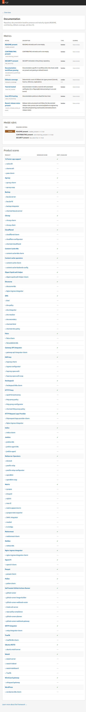

# Adding a Metric to an Existing Dimension

This guide walks you through adding a new metric to an existing PQF quality dimension — the most
common contributor task. By the end you will have a working metric that fetches real data from
the GitHub API, gets tested, appears in the dashboard, and can optionally gate medal awards.

We use a concrete example throughout: adding a **`has_changelog`** metric to the
`documentation` dimension that checks whether a repository has a `CHANGELOG.md` file.

> **Which framework version?** Metrics are declared per framework version. Add new metrics to the
> **upcoming** version (`framework/versions/v1/`) by default — that is the planning bar. Adding or
> changing a scored metric in the **active** version is a scoring-semantic change to today's
> official compliance view, and needs explicit framework-owner review. **Archived** versions are
> frozen and must never be edited to change scoring.

---

## How metrics flow through PQF

Before touching any code, here is how a metric goes from detector to dashboard:

```
scorers/documentation/logic.py        ← you add detection logic here
          │  compute_metrics() returns dict with new key
          ▼
scorers/registry.py                   ← you bind an implementation revision ID to that key
          │
          ▼
framework/versions/<version>/dimensions.yaml
          │  ← you declare the output (selecting that implementation) here
          │    assemble.py reads outputs + medals
          ▼
computed/versions/<version>/<product>.json    ← GHA-written (or make _merge locally)
          │
          ▼
public/versions/<version>/portfolio.json      ← GHA-written (or make _assemble locally)
          │
          ▼
Dashboard (make dev → localhost:5173) ← new metric appears under that framework version
```

The key constraint is the **pure/IO split**: `logic.py` contains only pure functions that accept
all external data as parameters. No `os.environ`, no file reads, no side effects, and **no
branching on framework version**. The version-aware runner (`scorers/run.py`, which you do *not*
need to edit for a new metric) reads env vars, resolves the framework contract, and dispatches the
implementation revisions that contract selects.

---

## Metric ID vs implementation revision

A metric has two identities:

| Identity | Example | Stability |
|----------|---------|-----------|
| **Metric ID** — the output key | `has_changelog` | Stable, user-facing concept. Shared across versions. |
| **Implementation ID** — the measurement revision | `changelog-present/v1` | Immutable. A changed detector means a **new** revision. |

If you need to change *how* an existing metric is measured, do not edit the existing
implementation's behaviour in place. Add a new revision (`changelog-present/v2`) with its own
binding, and point the contract that should adopt it at the new ID. That keeps the semantic change
visible in review and stops one correction from silently rescoring every version that references
the old ID.

---

## Prerequisites

```bash
# Python environment
make install          # installs pqf[dev] in editable mode

# UI (only needed if you want to see the dashboard)
make install-ui

# GitHub auth (auto-populates GITHUB_TOKEN via gh CLI)
gh auth login
```

---

## Step 1 — Understand the existing dimension

Open `framework/versions/v1/dimensions.yaml` and find the `documentation` block. The `outputs`
section lists every metric key the scorer must return and the implementation revision that produces
it, `required_metrics_for_scoring` lists the keys that must be measurable for the dimension to be
scored at all, and `medals` defines which keys gate each tier.

```yaml
# framework/versions/v1/dimensions.yaml (existing — do not edit yet)
  documentation:
    label: "Documentation"
    required_metrics_for_scoring: [readme_present, contributing_present, has_security, release_notes_process_implemented]
    outputs:
      readme_present:
        implementation: "readme-present/v1"
        type: boolean
        label: "README present"
      contributing_present:
        implementation: "contributing-present/v1"
        type: boolean
        label: "CONTRIBUTING present"
      has_security:
        implementation: "security-file-present/v1"
        type: boolean
        label: "SECURITY present"
      release_notes_process_implemented:
        implementation: "release-notes-process-implemented/v1"
        type: boolean
        label: "Release notes process implemented"
      diataxis_coverage_ai:
        implementation: "diataxis-coverage-ai/v1"
        type: number
        range: "0–4"
        informational: true
    medals:
      bronze: ["readme_present == true"]
      silver: ["readme_present == true", "contributing_present == true"]
      gold:   [..., "release_notes_process_implemented == true"]
```

A metric declared in `outputs` **must** appear as a key in the `compute_metrics` return value of
the runner its implementation binds to. If the key is missing, the pipeline errors. Keep that
contract in mind.

---

## Step 2 — Declare the new metric in the framework contract

Add `has_changelog` to the `outputs` map of the `documentation` dimension in the framework version
you are targeting (here, the upcoming `v1`). Place it after the existing deterministic metrics
(before the `informational` ones at the bottom is a good convention):

```diff
# framework/versions/v1/dimensions.yaml
       release_notes_process_implemented:
         implementation: "release-notes-process-implemented/v1"
         type: boolean
         label: "Release notes process implemented"
         description: "Repository has canonical release-notes workflow + structure evidence."
+      has_changelog:
+        implementation: "changelog-present/v1"
+        type: boolean
+        label: "CHANGELOG present"
+        description: "CHANGELOG.md exists in the repository root."
+        informational: true
       diataxis_coverage_ai:
         implementation: "diataxis-coverage-ai/v1"
         type: number
```

**Key fields:**

| Field | Required | Notes |
|-------|----------|-------|
| `implementation` | Yes | Metric implementation revision ID bound in `scorers/registry.py`. Unknown IDs fail `make validate`. |
| `type` | Yes | `boolean` or `number` |
| `label` | Yes | Short human-readable name shown in the dashboard |
| `description` | Yes | One sentence: what the metric checks and how |
| `informational` | No | `true` = shown in dashboard but never gates results |
| `ai_assisted` | No | `true` = renders an ✦ AI badge in the UI |

> **Not adding `has_changelog` to a medal tier yet?** That's fine — leave it out of `medals` for
> now and mark it `informational: true`. It will appear in the dimension detail as a data point.
> See [Step 9](#step-9--optionally-promote-to-a-result-gate) when you're ready to make it gate a
> tier.

---

## Step 3 — Bind the implementation revision in `scorers/registry.py`

`scorers/registry.py` maps each implementation revision ID to the dimension, output key, and pure
runner that produces it:

```diff
# scorers/registry.py
         "release-notes-process-implemented/v1": MetricBinding(
             dimension="documentation",
             output_key="release_notes_process_implemented",
             runner_key="documentation",
         ),
+        "changelog-present/v1": MetricBinding(
+            dimension="documentation",
+            output_key="has_changelog",
+            runner_key="documentation",
+        ),
```

`make validate` checks that every declared implementation exists, belongs to the dimension that
declares it, resolves to the same output key, and references a known runner.

---

## Step 4 — Implement detection in `logic.py`

Open `scorers/documentation/logic.py`. The file is structured as a set of small private helper
functions (one per metric) followed by the public `compute_metrics` function at the bottom.

Add a new private helper after the existing file-existence helpers:

```python
# scorers/documentation/logic.py — add this helper

def _has_changelog(unit: EvaluationUnit, github_token: str | None) -> bool:
    """Return True if CHANGELOG.md exists and is non-empty in the repository root."""
    return _file_exists(unit, "CHANGELOG.md", github_token)
```

The `_file_exists` helper is already defined in the same file — it wraps
`scorers.shared.github_signals.repo_file_exists` with monorepo subpath awareness (the `unit.subpath`
field). Use it whenever you need to check whether a file exists; use `_file_text` if you need the
file's content.

> **Why a private helper instead of calling `repo_file_exists` directly?**
> Because `_file_exists` automatically scopes the path to `unit.subpath` for monorepo products
> (e.g., a charm living at `operators/my-charm/` within a larger repo). Calling
> `repo_file_exists` directly would miss files in those products.

---

## Step 5 — Return the new key from `compute_metrics`

The `compute_metrics` function is a single `return` dict at the bottom of `logic.py`. Add your new
key to it:

```diff
 def compute_metrics(
     unit: EvaluationUnit,
     github_token: str,
     openrouter_api_key: str,
     model: str = "anthropic/claude-sonnet-4.5",
 ) -> dict[str, Any]:
     check_runs = default_branch_check_runs(unit.repo, github_token)
     return {
         "readme_present": _readme_present(unit, github_token),
         "contributing_present": _contributing_present(unit, github_token),
         "has_security": _file_exists(unit, "SECURITY.md", github_token),
         "documentation_workflows_passing": _documentation_workflows_passing(check_runs),
         "diataxis_coverage_ai": _diataxis_coverage_ai(
             unit, github_token, openrouter_api_key, model=model
         ),
         "uses_rtd_hosting": _uses_rtd_hosting(unit, github_token),
         "release_notes_process_implemented": _release_notes_process_implemented(unit, github_token),
+        "has_changelog": _has_changelog(unit, github_token),
     }
```

> **The key in this dict must exactly match the output key declared in the framework contract.** A
> mismatch causes a `KeyError` in `engine/assemble.py` when the pipeline runs.

---

## Step 6 — Write tests

Tests live in `scorers/documentation/__tests__/test_logic.py`. The project uses `pytest-mock` to
patch helper functions — you never make real HTTP calls in tests.

Look for the existing test that covers default (all-false) outputs and add your new key:

```diff
 def test_compute_metrics_defaults_signals_when_repo_signals_missing(mocker):
     ...
     result = compute_metrics(unit, "gh-token", "")

     assert result == {
         "readme_present": False,
         "contributing_present": False,
         "has_security": False,
         "documentation_workflows_passing": False,
         "diataxis_coverage_ai": 0,
         "uses_rtd_hosting": False,
         "release_notes_process_implemented": False,
+        "has_changelog": False,
     }
```

Then add a dedicated test for your metric's positive path. The pattern is always the same: patch
the helper at the point `logic.py` imports it, not at `github_signals`:

```python
def test_has_changelog_true_when_file_exists(mocker):
    mocker.patch(
        "scorers.documentation.logic.repo_file_exists",
        side_effect=lambda repo, path, token: path == "CHANGELOG.md",
    )
    mocker.patch("scorers.documentation.logic.repo_releases", return_value=[])
    mocker.patch("scorers.documentation.logic.repo_file_text", return_value="")
    mocker.patch("scorers.documentation.logic.default_branch_check_runs", return_value=[])
    mocker.patch("scorers.documentation.logic.workflow_files", return_value=[])

    result = compute_metrics(UNIT, "gh-token", "")
    assert result["has_changelog"] is True


def test_has_changelog_false_when_file_missing(mocker):
    mocker.patch(
        "scorers.documentation.logic.repo_file_exists",
        return_value=False,
    )
    mocker.patch("scorers.documentation.logic.repo_releases", return_value=[])
    mocker.patch("scorers.documentation.logic.repo_file_text", return_value="")
    mocker.patch("scorers.documentation.logic.default_branch_check_runs", return_value=[])
    mocker.patch("scorers.documentation.logic.workflow_files", return_value=[])

    result = compute_metrics(UNIT, "gh-token", "")
    assert result["has_changelog"] is False
```

> **Why patch `logic.repo_file_exists` and not `shared.github_signals.repo_file_exists`?**
> Because Python's mock patches the *name as it is used in the module under test*. Since
> `logic.py` imports `repo_file_exists` directly, you patch it at its import site in `logic`.

---

## Step 7 — Run tests and lint

```bash
# Run only the documentation scorer tests:
python3 -m pytest scorers/documentation/ -v

# Run the full test suite (takes ~30 seconds):
make test

# Check for lint errors:
make lint
```

All tests should pass. If you see a `KeyError` on your new key, the most likely cause is a
mismatch between the output key declared in the framework contract and the key name in the
`compute_metrics` return dict.

---

## Step 8 — Score locally and see it in the dashboard

Run the full local pipeline against any product, for the framework version you edited (we use
`matrix` and `v1` here as an example). Every runtime command needs an explicit `FRAMEWORK_VERSION`:

```bash
make score-no-llm PRODUCT=matrix FRAMEWORK_VERSION=v1  # → .pqf-score/v1/matrix/
make _merge PRODUCT=matrix FRAMEWORK_VERSION=v1        # → computed/versions/v1/matrix.json
make _assemble FRAMEWORK_VERSION=v1                    # → public/versions/v1/portfolio.json
make _version-index                                    # → public/framework-versions.json

make dev                           # start Vite dev server → http://localhost:5173
```

Select that framework version in the dashboard's version selector, then navigate to the
**Documentation** dimension. Your new `has_changelog` metric will appear in the metric list for
every scored product in that version:



These generated files are GHA-maintained previews — inspect them locally, but never commit them.
See [Run PQF locally](local-scoring.md) for AI-assisted scoring, criteria-only changes,
full-portfolio runs, and generated-artifact guidance.

---

## Step 9 — Optionally promote to a result gate

If you want `has_changelog` to gate a tier, drop `informational: true` and add a criterion to that
version's `medals` section. Tiers are **cumulative** — a product earning silver must also satisfy
all bronze criteria.

```diff
# framework/versions/v1/dimensions.yaml
     medals:
       bronze: ["readme_present == true"]
-      silver: ["readme_present == true", "contributing_present == true"]
+      silver: ["readme_present == true", "contributing_present == true", "has_changelog == true"]
       gold:   ["readme_present == true", "contributing_present == true", "has_security == true", "release_notes_process_implemented == true"]
```

> Promote metrics in the **upcoming** version. Promoting a metric in the **active** version changes
> today's official compliance view and requires explicit framework-owner review; CI's semantic
> change report flags it as a scoring-semantic change.

> **Result criteria syntax**
>
> | Syntax | Example | When to use |
> |--------|---------|------------|
> | `metric == true` | `has_changelog == true` | Boolean — must be true to pass |
> | `metric == false` | `has_violations == false` | Boolean — must be false to pass |
> | `metric >= value` | `coverage_pct >= 80` | Number — at or above threshold |
> | `metric <= value` | `avg_triage_days <= 5` | Number — at or below threshold |

After a criteria-only change you can regenerate results from existing scorer output without
re-running the scorer:

```bash
make validate
make _assemble FRAMEWORK_VERSION=v1   # re-evaluates results from current computed/versions/v1/
make dev
```

---

## Checklist before opening a PR

- [ ] `framework/versions/<version>/dimensions.yaml` — new key added to `outputs` with `implementation`, `type`, `label`, `description`
- [ ] `scorers/registry.py` — implementation revision ID bound to the dimension and output key
- [ ] `scorers/documentation/logic.py` — new private helper + key returned from `compute_metrics`
- [ ] `scorers/documentation/__tests__/test_logic.py` — default-false test updated; positive and negative path tests added
- [ ] `make validate` passes
- [ ] `make test` passes
- [ ] `make lint` passes
- [ ] `make score-no-llm PRODUCT=<any-product> FRAMEWORK_VERSION=<version>` runs without error
- [ ] `make _merge PRODUCT=<any-product> FRAMEWORK_VERSION=<version> && make _assemble FRAMEWORK_VERSION=<version>` updates `public/versions/<version>/portfolio.json`
- [ ] New metric appears in the dashboard under that framework version (`make dev`)
- [ ] No generated `computed/`, `public/`, or `.pqf-score/` preview files are staged

---

## Reference: shared GitHub signal helpers

These helpers live in `scorers/shared/github_signals.py` and are imported directly into scorer
`logic.py` files. Use them instead of making raw `requests` calls.

| Helper | Signature | Returns | When to use |
|--------|-----------|---------|-------------|
| `repo_file_exists` | `(owner_repo, path, token)` | `bool` | Check if a file exists at a specific path |
| `repo_file_text` | `(owner_repo, path, token)` | `str` | Fetch the text content of a file (empty string on failure) |
| `repo_topics` | `(owner_repo, token)` | `list[str]` | List GitHub repository topics |
| `workflow_files` | `(owner_repo, token)` | `list[tuple[str, str]]` | All `(filename, content)` pairs from `.github/workflows/` |
| `default_branch_check_runs` | `(owner_repo, token)` | `list[dict]` | Latest CI check runs on the default branch HEAD |
| `search_code_count` | `(query, token)` | `int` | GitHub code search — count of matches for a query |
| `repo_releases` | `(owner_repo, token)` | `list[dict]` | All GitHub releases for a repository |

> All helpers retry anonymously when a token produces an auth error on a public repo, so you
> rarely need to handle 401/403 specially in `logic.py`.

---

## Troubleshooting

**`unknown metric implementation ... referenced by output ...` when running `make validate`**
The `implementation` ID you declared in the framework contract has no binding in
`scorers/registry.py`. Add the `MetricBinding`, or fix the typo in the ID.

**`KeyError: 'has_changelog'` when running `make _assemble`**
The key in your `compute_metrics` return dict does not match the output key declared in
`framework/versions/<version>/dimensions.yaml`. Check for typos in both places.

**`AssertionError: result == {...}` in the default-false test**
You added a key to `compute_metrics` but did not add it to the `assert result == {...}` dict in
the test. Update the expected dict to include your new key with its default value.

**Tests are making real HTTP calls (slow, or failing in CI without a token)**
You are patching the wrong module path. Patch `scorers.documentation.logic.repo_file_exists`,
not `scorers.shared.github_signals.repo_file_exists`. The patch must be applied at the import
site in the module under test.

**`FRAMEWORK_VERSION is required` when running any scoring target**
Local runtime commands never default to a framework version. Pass `FRAMEWORK_VERSION=<id>` on every
`score*`, `_merge`, and `_assemble` invocation.

**`Framework version <id> is archived and cannot be used for scorer execution`**
Archived measurements are frozen and are never recomputed. Score the active or upcoming version
instead.

**`make score-no-llm` exits non-zero with `json.JSONDecodeError`**
A helper returned an unexpected response type. Add a `print` statement or use `pdb` to inspect
what the GitHub API returned. Common cause: rate limiting (try `gh auth token` to refresh).

**New metric shows `null` for all products in the dashboard**
The scorer ran but the key was `None` in Python. Check that your helper returns `False` (not
`None`) in the default/error path. `None` serialises to `null` in JSON and causes
`insufficient_data` for required metrics.

**Dashboard doesn't show the new metric at all**
Check that you are looking at the framework version you edited in the version selector, and that
`public/versions/<version>/portfolio.json` was regenerated. Run
`make _assemble FRAMEWORK_VERSION=<version>` and refresh. If the metric appears in
`computed/versions/<version>/<product>.json` but not in that version's `portfolio.json`, a stale
build artefact may be the cause — rerun the assemble step.
