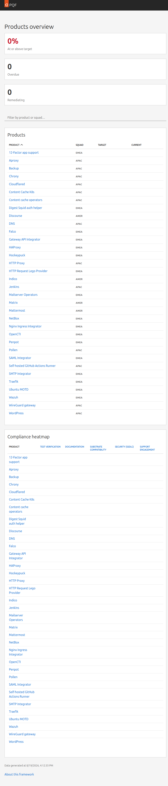

# Products Overview

The Products Overview is the main landing page of PQF. It shows the quality state of Canonical Platform Engineering's tracked products at a glance.

---

## Products Table

The **Products** table lists every tracked product with its current quality state.

| Column | Description |
|--------|-------------|
| **Product** | Product name, linking to its detail page |
| **Current** | Current overall result (gold / silver / bronze / below minimum / no data) |
| **Target** | The result the team has committed to achieving |
| **Drift** | Whether the product is falling behind its target (see below) |
| **Squad** | Owning team (AMER / EMEA / APAC), linked to the GitHub team |
| **Actions** | Link to the Product Detail page |

### Result colours

| Result | Colour | Meaning |
|-------|--------|---------|
| 🥇 Gold | `#C7962F` | Meets all gold-tier criteria |
| 🥈 Silver | `#8F8F8F` | Meets all silver-tier criteria |
| 🥉 Bronze | `#9E622A` | Meets all bronze-tier criteria |
| ⬇ Below minimum | `#C7162B` | Measured, but did not meet minimum criteria |
| — No data | `#666` | Scoring data not yet available |

### Drift indicators

Drift tracks whether a product is moving toward or away from its target result over time.

| Indicator | Meaning |
|-----------|---------|
| ⬆ | Result improved since last week |
| ⬇ Remediating | Result dropped below target — team has time to fix |
| ⬇ Overdue | Remediation window has expired without recovery |
| — | No change |

---

## Product Heatmap

The **Heatmap** shows each product's result across every quality dimension, making it easy to spot which dimensions need the most attention across tracked products.

Rows are products; columns are quality dimensions. Each cell shows the result for that product × dimension combination using the same colour coding as the Products table.
